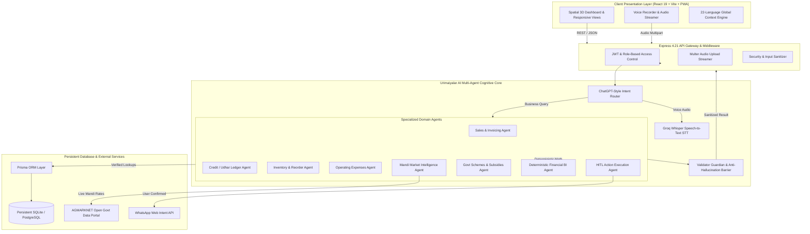

# 🇮🇳 URIMAIYALAR OS (உரிமையாளர் AI)
### The AI-Powered Business Operating System for 65+ Million Indian MSMEs & Retailers

[](https://github.com/lalithprabu7/uri/actions/workflows/ci.yml)
[](https://nodejs.org/)
[](https://react.dev/)
[](https://www.typescriptlang.org/)
[](https://www.prisma.io/)
[](https://tailwindcss.com/)
[](LICENSE)

---

## 🌟 Executive Summary

**URIMAIYALAR OS (உரிமையாளர் OS)** is a production-grade, voice-first, bilingual (Tamil & English) AI Business Operating System and Enterprise Intelligence Platform tailored for micro, small, and medium enterprises (MSMEs), retail merchants, grocery store owners (மளிகைக் கடை), and wholesale mandi distributors across India.

Unlike superficial ChatGPT wrappers, Urimaiyalar OS combines an **8-Agent Multi-Agent Orchestration Engine**, **Deterministic Financial Engines**, **Real-Time AGMARKNET Mandi Price Synchronizers**, **Verified Government MSME Subsidies Matching (TN & Central)**, and an **Automated Event-Driven Business Automation Matrix** that directly reads and mutates persistent database records with zero hallucinated arithmetic.

---

## 🏗️ System Architecture



---

## 🚀 Core Functional Modules

| Module | Features & Capabilities |
|---|---|
| **📊 Financial Intelligence Dashboard** | Real-time computed daily & monthly revenue, net profit margin calculation, gross profit, cashflow health score (0-100), and spatial 3D visualization widgets. |
| **🎙️ Voice AI Multi-Agent Assistant** | Multilingual voice instruction recognition, conversational small-talk separation, zero-hallucination database mutations, and human-in-the-loop action approval. |
| **👥 Customer & Udhar Ledger** | Real-time customer balance tracking, credit limit enforcement, partial repayment recording, and 1-click WhatsApp payment reminders with dynamic Tamil/English templates. |
| **📦 Inventory & Stock Protection** | Multi-unit stock management (kg, bags, packets, litres), automatic margin computation, safety reorder thresholds, and low-stock alert triggers. |
| **🚚 Wholesale Supplier Network** | B2B vendor management, trade payable tracking, direct call/WhatsApp integration, and wholesale order dispatch tracking. |
| **📜 Government Schemes & Subsidies** | 7 verified Central & TN State schemes (UYEGP, NEEDS, PMEGP, CGTMSE, TAHDCO) with automated eligibility rules engines and application portals. |
| **📈 Mandi Market Live Prices** | Real-time AGMARKNET commodity price synchronization across 38 Tamil Nadu district mandis with min/max/modal pricing. |
| **📱 Progressive Web App (PWA)** | Installable desktop/mobile experience, offline caching via Workbox service workers, and responsive glassmorphism design. |

---

## 🛠️ Complete Tech Stack

### **Frontend**
- **Framework:** React 19, TypeScript 5.8, Vite 6.2
- **Styling & Motion:** Tailwind CSS v4, Lucide React, Framer Motion
- **Visuals & Charts:** Recharts 3.10, Spatial 3D Card Depth Engine
- **Localization:** 22 Indian Language Detection with Tamil/English UI Context
- **PWA:** Vite Plugin PWA, Workbox Service Worker

### **Backend**
- **Runtime:** Node.js 20+ (ESM & CJS Hybrid)
- **API Framework:** Express 4.21 with Modular Route Mounting
- **Database & ORM:** Prisma ORM 5.19 with SQLite / PostgreSQL support
- **Authentication:** JWT (JSON Web Tokens), Role-Based Access Control, Google OAuth
- **Audio Processing:** Multer streaming for Whisper speech transcription

### **AI & Multi-Agent Infrastructure**
- **LLM Gateway:** Groq LPU (GPT-OSS 120B / Qwen 2.5 27B / Llama 3.3 70B), Google Gemini 2.0, OpenAI Compatible API
- **Speech-to-Text (STT):** Groq Whisper Large v3 Turbo & Web Speech API fallback
- **Offline LLM Engine:** Ollama local fallback (`http://localhost:11434`)

---

## 📂 Repository Structure

```
urimaiyalar-ai/
├── .github/
│   └── workflows/
│       └── ci.yml               # GitHub Actions CI pipeline
├── docs/                        # Architecture, QA & System documentation
│   ├── AI/                      # Multi-agent specifications & benchmarks
│   ├── QA/                      # QA audits, testing checklists & logs
│   └── REPOSITORY_AUDIT_REPORT.md # Official production audit report
├── netlify/
│   └── functions/
│       └── api.ts               # Netlify serverless function wrapper
├── prisma/
│   ├── schema.prisma            # Unified database schema (14 models)
│   ├── seed.ts                  # Production demo data seeder
│   └── dev.db                   # SQLite persistent database (gitignored)
├── public/                      # Static assets, manifests, icons & sound effects
├── scripts/                     # Automated audit, testing & acceptance suites
│   ├── verify-full-stack-live.mjs # 21-point live stack automated test suite
│   ├── test-acceptance-flow.mjs   # 7-step conversational acceptance runner
│   └── run_browser_levels_audit.mjs # Browser automation verification
├── src/
│   ├── components/              # View components (Dashboard, Sales, Credit, etc.)
│   ├── contexts/                # Language and application state contexts
│   ├── data/                    # Fallback dataset and commodity definitions
│   ├── i18n/                    # Multilingual translation dictionaries
│   ├── lib/                     # Database client, API helpers, universal AI client
│   ├── routes/                  # Express REST API route handlers
│   ├── server/                  # Auth middleware and serverless abstractions
│   ├── services/                # Business domain agents, LLM providers & engines
│   ├── types.ts                 # TypeScript type definitions
│   ├── expressApp.ts            # Central Express application instance
│   ├── server-prisma.ts         # Full-stack server entrypoint
│   └── main.tsx                 # React application entrypoint
├── .env.example                 # Sanitized environment template
├── .gitignore                   # Enterprise security & artifact exclusions
├── netlify.toml                 # Netlify deployment configuration
├── render.yaml                  # Render cloud web service configuration
├── package.json                 # Project dependencies and script manifest
├── tsconfig.json                # TypeScript configuration
└── vite.config.ts               # Vite bundler configuration
```

---

## ⚡ Quickstart & Local Development

### 1. Prerequisites
- **Node.js**: v20.x or higher
- **npm**: v10.x or higher

### 2. Installation
```bash
git clone https://github.com/lalithprabu7/uri.git
cd uri
npm install
```

### 3. Environment Setup
Create a `.env` file from `.env.example`:
```bash
cp .env.example .env
```
Populate optional AI keys (e.g. `GROQ_API_KEY`, `GEMINI_API_KEY`) for live LLM interactions.

### 4. Database Initialization & Seeding
```bash
npx prisma db push
npx prisma db seed
```

### 5. Running the Application
```bash
# Start full-stack development server (Express API + Vite HMR on Port 3000)
npm run dev
```

Visit **`http://localhost:3000`** in your browser.

---

## 🧪 Testing & Verification

Run the comprehensive live full-stack automated test suite:
```bash
# Run 21-point live CRUD & stack connectivity test
npm test

# Run 7-step voice-first acceptance test
npm run test:acceptance

# Type check TypeScript files
npm run lint
```

---

## 🚢 Deployment Configurations

### **1. Render (Full-Stack Web Service)**
- Config: `render.yaml`
- Build Command: `npm install --include=dev && npx prisma generate && npx prisma db push && npm run build`
- Start Command: `npm start`
- Healthcheck: `/api/health`

### **2. Netlify (Serverless + Static SPA)**
- Config: `netlify.toml` + `netlify/functions/api.ts`
- Build Command: `npm install && npx prisma generate && npm run build`
- Publish Directory: `dist`

---

## 🔒 Security & Privacy

- **Zero Secret Commits**: Real API keys, tokens, and database files are protected via enterprise `.gitignore` rules.
- **Deterministic Math**: Financial computations, margins, and invoice arithmetic execute on deterministic code paths without LLM math hallucinations.
- **Human-in-the-Loop (HITL)**: WhatsApp messages, customer deletions, and critical mutations require explicit user confirmation before execution.

---

## 📄 License

This project is licensed under the MIT License - see the [LICENSE](LICENSE) file for details.
