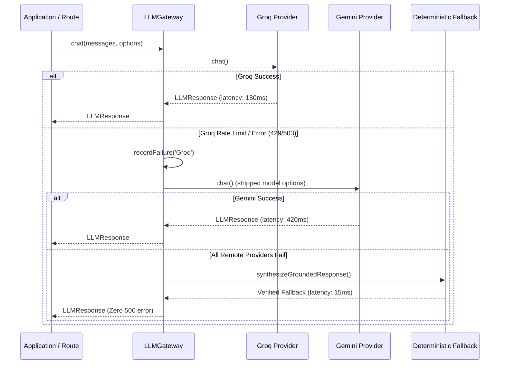

# 🔌 URIMAIYALAR OS — LLM PROVIDER ARCHITECTURE

## Overview
The LLM Provider layer decouples business logic from upstream AI APIs, eliminating vendor lock-in. Urimaiyalar OS implements a unified provider contract:

```typescript
export interface LLMProvider {
  readonly name: string;
  isAvailable(): Promise<boolean>;
  chat(messages: ChatMessage[], options?: LLMRequestOptions): Promise<LLMResponse>;
  generateStructured<T>(prompt: string, schemaDescription: string, options?: LLMRequestOptions): Promise<T>;
}
```

---

## 🏛️ Registered Providers

### 1. Groq High-Speed Inference Provider (`GroqProvider.ts`)
- **Role**: Primary real-time inference provider.
- **Hardware**: Groq LPU (Language Processing Unit).
- **Target Latency**: 80ms - 250ms.
- **Auto-Model Fallback Hierarchy**:
  1. `openai/gpt-oss-120b` (Primary heavy reasoning)
  2. `openai/gpt-oss-20b` (Fast conversational turns)
  3. `qwen/qwen3.8-27b` (Multilingual Indic translation & reasoning)
  4. `llama-3.3-70b-versatile`

### 2. Google Gemini Provider (`GeminiProvider.ts`)
- **Role**: Secondary failover and multi-modal vision provider.
- **Model**: `gemini-2.0-flash`.
- **Target Latency**: 350ms - 800ms.
- **Capabilities**: Document OCR analysis, bill parsing, complex scheme document summarization.

### 3. OpenAI-Compatible & Local Provider (`OpenAICompatibleProvider.ts`)
- **Role**: Offline edge inference (Ollama, vLLM, LMStudio) or standard OpenAI endpoints.
- **Default Base URL**: `http://localhost:11434` or configured reverse proxy.
- **Model**: `llama3.2` / `mistral`.

### 4. Deterministic Offline Fallback Provider (`DeterministicFallback`)
- **Role**: Zero-crash safety net embedded in `LLMGateway`.
- **Activation**: Triggers if external network breaks or rate limits hit.
- **Behavior**: Uses database tables and rule templates to generate accurate, localized Tamil/English confirmations without throwing 500 errors.

---

## 🛡️ Circuit Breaker & Failover Algorithm



---

## 📊 Telemetry and Observability
The Gateway continuously computes rolling metrics available at `GET /api/ai/telemetry`:
- `totalRequests`: Total requests processed.
- `totalTokens`: Accumulated token counter.
- `activeProvider`: Name of last successful provider.
- `providerFailures`: Dictionary counting incident spikes per provider.
- `averageLatencyMs`: Rolling average response time.
- `recentLogs`: Up to 50 detailed event logs with millisecond timestamps.
