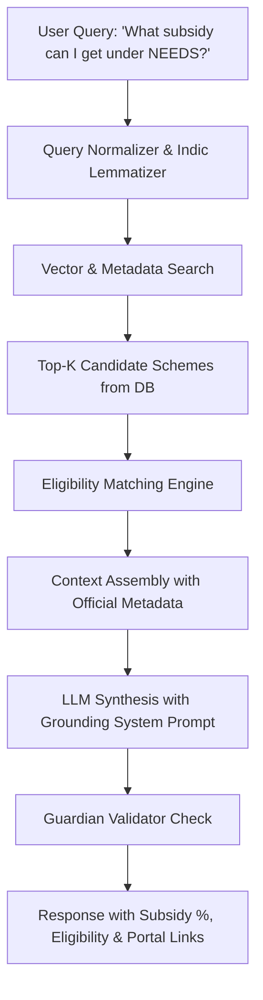

# 📚 URIMAIYALAR OS — RAG & GOVERNMENT SCHEME ARCHITECTURE

## Overview
Small merchants in Tamil Nadu and India routinely miss out on valuable government subsidies because policies are scattered across complex portals (MSME, MyScheme, SIDBI, Tiic). The Urimaiyalar RAG subsystem provides evidence-grounded answers with zero hallucinations.

---

## 🏛️ Ground-Truth Scheme Database
Urimaiyalar OS bootstraps verified central and Tamil Nadu state schemes directly in `prisma.scheme`:
1. **PMEGP (Prime Minister Employment Generation Programme)**:
   - Subsidy: 15% - 35% margin money subsidy.
   - Max Project: ₹50 Lakhs (Manufacturing), ₹20 Lakhs (Services).
2. **NEEDS (New Entrepreneur-cum-Enterprise Development Scheme - Tamil Nadu)**:
   - Subsidy: 25% capital subsidy up to ₹75 Lakhs + 3% interest subvention.
3. **Mudra Yojana (Shishu, Kishore, Tarun)**:
   - Collateral-free loans up to ₹10 Lakhs.
4. **PM Vishwakarma Scheme**:
   - Artisans & traditional craftsmen, ₹1 - ₹2 Lakhs collateral free at 5% interest.
5. **Udyam Registration Benefits**:
   - Priority sector lending, ISO subsidy, delayed payment protection.
6. **CGTMSE**:
   - Credit guarantee for micro & small enterprises up to ₹5 Crore.
7. **Tamil Nadu Annal Ambedkar Business Champions Scheme (AABCS)**:
   - 35% capital subsidy for SC/ST entrepreneurs.

---

## 🔍 Retrieval-Augmented Generation Pipeline

---

## 🛡️ Anti-Hallucination Guardrails
1. **Refusal on Low Relevance**: If semantic retrieval score is below 0.60, the system responds:
   > *"I could not find an official government scheme matching those specific requirements in the verified repository. Please consult your local District Industries Centre (DIC) or msme.gov.in."*
2. **Mandatory Metadata Citation**: Every generated scheme recommendation must include:
   - Official Ministry / Dept Name
   - Exact Subsidy Range (%)
   - Maximum Project Cost Limit
   - Official Application Link (`https://...`)
3. **Zero Fabricated Schemes**: The model is prohibited by system instructions from inventing non-existent scheme names.
