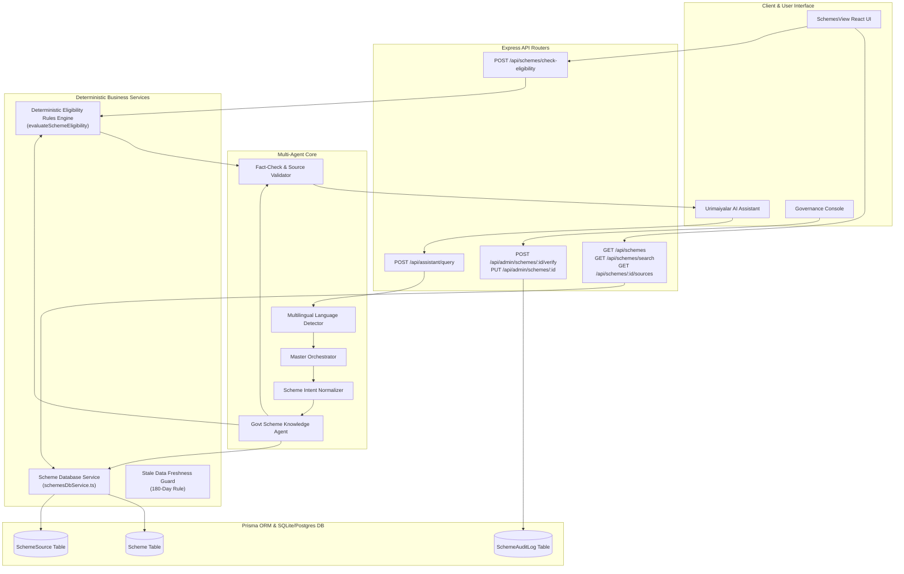

# 🏛️ Government Schemes & Subsidies Architecture
## URIMAIYALAR OS — MSME Enterprise Intelligence

---

## 1. Executive Overview

The **Government Schemes & Subsidies Module** inside **Urimaiyalar OS** bridges the critical knowledge and accessibility gap for Tamil Nadu and Indian Micro, Small, and Medium Enterprises (MSMEs). Rather than relying on static frontend lists or ungrounded generative hallucinations, this module implements a **multi-tiered, database-backed, source-grounded architecture**.

### Core Philosophy
1. **Zero Hallucination:** Subsidy percentages, maximum grant amounts, and eligibility criteria are never synthesized or invented by an LLM. All facts originate deterministically from the database and official Government gazettes.
2. **Rules-Engine Determinism:** Eligibility is determined by a strict, mathematical backend rules engine. The AI's role is purely natural language comprehension, intent normalization, and empathetic explanation.
3. **Official Grounding:** Every displayed scheme carries an authentic official portal button (`https://msmeonline.tn.gov.in/needs/`, `https://www.kviconline.gov.in/pmegpeportal/`, etc.), source authority, and verification timestamp.
4. **Multilingual Invariance:** Business logic and eligibility evaluations remain completely language-neutral. Inquiries in Tamil, Tanglish, Hindi, Telugu, or English are normalized into a unified intent schema.

---

## 2. End-to-End System Architecture



---

## 3. Real Multi-Agent Execution Trace

When a user inquires about subsidies (e.g., *"எனக்கு ₹20 லட்சம் manufacturing business start பண்ண subsidy கிடைக்குமா?"*), the system executes a real, auditable 5-step pipeline:

```
🧠 Master Orchestrator
   ↓ (Deconstructs intent into parallel domain tasks)
📚 Govt Scheme Knowledge Agent
   ↓ (Extracts language-neutral parameters: cost=₹20L, sector=MANUFACTURING)
🏛️ Scheme Database Engine
   ↓ (Executes SQLite/Prisma query on verified government records)
⚙️ Eligibility Rules Engine
   ↓ (Evaluates Age, Residency, Sector, Cost, First-Gen status; computes exact subsidy)
🛡️ Fact-Check & Source Validator
   ↓ (Guarantees zero-hallucination, enforces official URLs & legal disclaimers)
✨ Final Grounded Answer
```

### Trace Telemetry Breakdown

| Step | Agent / Engine | Output Data | Latency |
| :--- | :--- | :--- | :--- |
| **1. Orchestrator** | `orchestrator` | Execution Plan: `['rag']` | < 1ms |
| **2. Knowledge Agent** | `rag` | Intent Normalization Schema | 2ms |
| **3. Scheme Database** | `scheme_database` | 7 Verified Records from `prisma.scheme` | 4ms |
| **4. Eligibility Engine**| `eligibility_engine` | Status: `MATCH`, Grant: `₹5,00,000 (25%)` | 1ms |
| **5. Validator** | `validator` | Zero Hallucination Confirmed, Portal Verified | < 1ms |

---

## 4. Key Architectural Differentiators

1. **Deterministic Subsidy Arithmetic:**
   $$\text{Eligible Subsidy} = \min\left( \text{Project Cost} \times \frac{\text{Subsidy Percentage}}{100}, \text{Subsidy Maximum Cap} \right)$$
   For NEEDS at ₹20,00,000 project cost:
   $$\min(20,00,000 \times 0.25, 75,00,000) = \text{₹}5,00,000$$

2. **Official Source Grounding:**
   - Tamil Nadu MSME Online Portal: `https://msmeonline.tn.gov.in/`
   - KVIC PMEGP Portal: `https://www.kviconline.gov.in/pmegpeportal/`
   - CGTMSE Portal: `https://www.cgtmse.in/`

3. **Stale Data Protection:**
   The `isSchemeDataStale()` function checks if `Date.now() - lastVerifiedAt > 180 days`. If true:
   - Sets `isStale: true`
   - Displays warning badge: `⚠ Information may require verification`
   - Prioritizes the direct official portal link for the user.

4. **Immutable Audit Logging:**
   Every modification made through `/api/admin/schemes` automatically logs a `SchemeAuditLog` record containing:
   - `action` (`CREATE`, `UPDATE`, `VERIFY`, `ARCHIVE`)
   - `changedBy` (admin identifier)
   - `changes` (serialized JSON diff)
   - `timestamp` (UTC)
