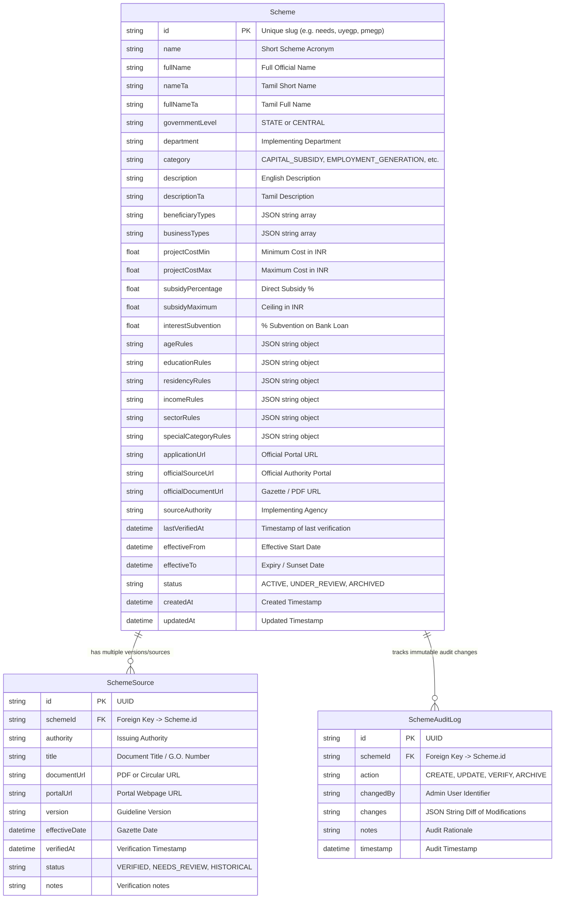

# 💾 Government Scheme Data Model
## Prisma Schema & Relational Specifications

---

## 1. Relational ER Diagram



---

## 2. JSON Rule Schemas

### `ageRules` Schema
```json
{
  "min": 21,
  "maxGeneral": 35,
  "maxSpecial": 45,
  "specialCategories": ["WOMEN", "SC", "ST", "BC", "MBC", "MINORITY", "TRANSGENDER", "EX_SERVICEMEN", "DIFFERENTLY_ABLED"],
  "description": "Minimum 21 years; Maximum 35 for General, up to 45 for Special Categories."
}
```

### `educationRules` Schema
```json
{
  "minimum": "DEGREE_DIPLOMA_ITI",
  "description": "Degree, Diploma, ITI, or accredited Vocational Certificate."
}
```

### `residencyRules` Schema
```json
{
  "state": "Tamil Nadu",
  "minYears": 3,
  "description": "Resident of Tamil Nadu for minimum 3 years."
}
```

### `incomeRules` Schema
```json
{
  "maxAnnualFamilyIncome": 500000,
  "description": "Annual family income must not exceed ₹5,00,000 per annum."
}
```
