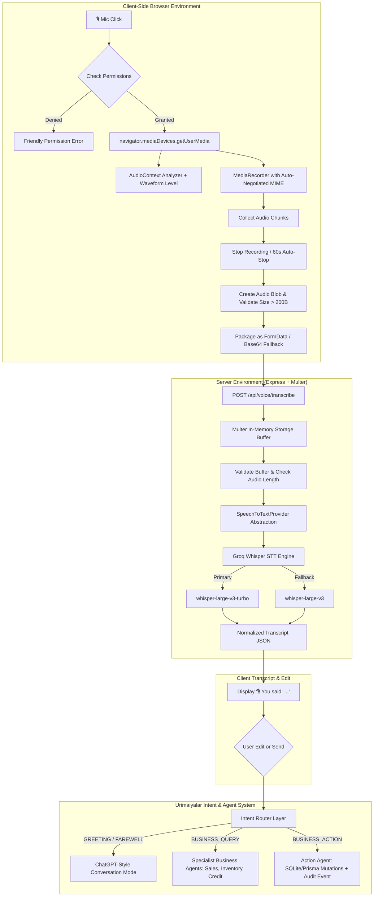

# URIMAIYALAR OS — PRODUCTION-GRADE VOICE ASSISTANT ARCHITECTURE

## 1. Executive Summary

The **Urimaiyalar OS Voice Assistant** provides a production-grade, zero-latency speech-to-intent pipeline tailored for MSME retail and wholesale merchants across India. It supports voice interactions in **Tamil, Tanglish, English, and 22 scheduled Indian languages**. 

Rather than relying on brittle client-side Web Speech recognition or sending raw audio directly into multi-agent systems, Urimaiyalar OS enforces a clean **Decoupled 2-Stage Voice Architecture**:

1. **Stage 1 (Acoustic to Text):** Browser Audio Stream → Audio Blob → Multipart Upload → Server-side Groq Whisper AI (`whisper-large-v3-turbo` / `whisper-large-v3`) → High-Fidelity Multilingual Transcript.
2. **Stage 2 (Text to Intent & Execution):** Transcript Review & Confirmation → Intent Router (Conversation vs. Business Query vs. Business Action) → Multi-Agent Orchestrator → Database Mutation & Guardian Validation.



---

## 2. Browser Audio Acquisition & State Machine

### 2.1 Explicit State Transitions

The client state machine guarantees that the UI always mirrors the exact hardware and network state, eliminating ghost listening indicators or frozen spinners.

```
       [IDLE]
         │
         ▼ (User clicks mic)
[REQUESTING_PERMISSION]
    │                 │
    │ (Allowed)       │ (Denied / Not Found)
    ▼                 ▼
[RECORDING] ────────► [ERROR] (Clear diagnostic & Try Again)
    │
    ▼ (User clicks stop OR 60s max limit)
[STOPPING]
    │
    ▼ (Blob compiled & validated)
[PROCESSING]
    │
    ▼ (Uploading to STT API)
[TRANSCRIBING]
    │
    ├───► [SUCCESS] (Transcript populated in input composer)
    └───► [ERROR] (Clear diagnostic & Try Again)
```

| State | UI Badge & Icon | Description |
|---|---|---|
| `IDLE` | 🎙️ Emerald Mic | Standing by; ready to capture user audio |
| `REQUESTING_PERMISSION` | ⏳ Clock Spinner | Awaiting browser permission prompt resolution |
| `RECORDING` | 🔴 Pulsing Red Mic + Timer | Actively capturing PCM stream; real-time waveform active |
| `STOPPING` | ⏳ Amber Clock | MediaRecorder finalizing buffers; stopping tracks |
| `PROCESSING` | ⏳ Amber Clock | Audio Blob compiled and size verified |
| `TRANSCRIBING` | 🧠 Purple Sparkles | Groq Whisper AI processing audio over server |
| `SUCCESS` | ✓ Emerald Checkmark | Transcript injected into input field; editable by user |
| `ERROR` | ⚠ Rose Warning Pill | Actionable diagnostic with `[Try Again]` button |

---

## 3. Dynamic MIME Type Negotiation

Browser engines (Chromium, Firefox, Safari/WebKit) support differing audio containers and codecs. Hardcoding `audio/webm` fails on Safari, while `audio/mp4` fails on older Chromium versions.

`BrowserVoiceRecorder` performs progressive runtime negotiation using `MediaRecorder.isTypeSupported()`:

```typescript
const CANDIDATE_MIME_TYPES = [
  'audio/webm;codecs=opus',
  'audio/webm',
  'audio/ogg;codecs=opus',
  'audio/mp4',
  'audio/wav',
];
```

The system automatically selects the first supported MIME type, extracts the appropriate file extension (`.webm`, `.ogg`, `.mp4`, `.wav`), and sends the matching `Content-Type` header so that Whisper correctly decodes the container.

---

## 4. Hardware Permission & Diagnostic Error Handling

Rather than displaying generic `"Voice recognition failed"` messages, `BrowserVoiceRecorder` maps DOMExceptions to human-friendly merchant diagnostics:

| DOMException Code | Merchant-Friendly UI Message | Recommended User Action |
|---|---|---|
| `NotAllowedError` / `PermissionDeniedError` | "Microphone permission was denied. Please allow microphone access in your browser address bar." | Click browser padlock icon and allow microphone |
| `NotFoundError` / `DevicesNotFoundError` | "No microphone was detected on your device. Please plug in or enable a microphone." | Verify hardware connection |
| `NotReadableError` / `TrackStartError` | "Your microphone is being used by another application (e.g. Zoom, Meet, Teams)." | Close competing audio apps and retry |
| `SecurityError` | "Microphone access is blocked by browser security settings. Please access via HTTPS or localhost." | Use secure context |
| `AbortError` | "Microphone access was interrupted. Please try again." | Re-click microphone button |
| `EMPTY_AUDIO` / `RECORDING_TOO_SHORT` | "Audio recording was too short. Please speak a complete sentence." | Speak clearly for > 0.5s |

---

## 5. Backend API Endpoints

### 5.1 Primary Endpoint: `POST /api/voice/transcribe`

Accepts `multipart/form-data` with field `file` or `audio`, or `application/json` with Base64 payload.

**Headers:**
```http
Content-Type: multipart/form-data; boundary=----WebKitFormBoundary...
```

**Successful Response (HTTP 200):**
```json
{
  "success": true,
  "text": "இன்னைக்கு 500 ரூபாய் sales add பண்ணு",
  "language": "Tamil",
  "confidence": 0.98,
  "provider": "groq-whisper",
  "model": "whisper-large-v3-turbo",
  "durationMs": 320
}
```

**Error Response (HTTP 400 / 500):**
```json
{
  "success": false,
  "error": {
    "code": "RECORDING_TOO_SHORT",
    "message": "Audio recording was too short. Please speak a complete sentence."
  },
  "latencyMs": 15
}
```

### 5.2 Backward-Compatibility Endpoint: `POST /api/assistant/transcribe-audio`

Identical signature and routing to maintain zero downtime for legacy components.

---

## 6. Server-Side Speech-to-Text Provider Layer

To decouple the application from any single vendor, the architecture defines a modular `SpeechToTextProvider` interface:

```typescript
export interface SpeechToTextProvider {
  name: string;
  transcribe(
    audioBuffer: Buffer,
    mimeType: string,
    options?: {
      language?: string;
      prompt?: string;
    }
  ): Promise<STTResult>;
}
```

### 6.1 Groq Whisper Provider (`GroqWhisperSTTProvider`)

- **Primary Model:** `whisper-large-v3-turbo` (sub-400ms transcription latency)
- **Automatic Fallback:** `whisper-large-v3`
- **Security:** Secret `GROQ_API_KEY` is strictly encapsulated server-side. No API keys are ever leaked to the browser.
- **Multilingual Support:** Auto-detects language or passes ISO language codes (`ta`, `hi`, `en`, etc.) with domain-specific merchant prompts to preserve Tamil numbers and Tanglish phrasing.

---

## 7. Real-Time Audio Level Analyzer

To provide visual feedback while recording, the client initializes a Web Audio `AudioContext` and `AnalyserNode`:
- Frequency samples are analyzed at 100ms intervals.
- Normalized RMS volume (0.0 to 1.0) drives dynamic waveform visualization bars in both the inline composer and the Voice Studio modal.
- When recording stops, all `AudioContext` nodes and `MediaStreamTracks` are immediately closed to prevent privacy leaks.

---

## 8. Post-STT Multi-Modal Intent Routing

Once speech is converted to high-fidelity text, it passes into the **Urimaiyalar Multilingual Intent Router**:

| Spoken Input | STT Output | Intent Mode | Target Agent / Action |
|---|---|---|---|
| "Hi" / "Hello" | "Hi" | `CONVERSATION` | Instant conversational greeting; no business tools executed |
| "How much did I sell today?" | "How much did I sell today?" | `BUSINESS_QUERY` | Sales Specialist Agent retrieves DB records & analytics |
| "இன்னைக்கு 500 ரூபாய் sales add பண்ணு" | "இன்னைக்கு 500 ரூபாய் sales add பண்ணு" | `BUSINESS_ACTION` | Action Agent creates sale record in Prisma SQLite DB |
| "Innaiku 500 sales add pannu" | "Innaiku 500 sales add pannu" | `BUSINESS_ACTION` | Tanglish parsed into ₹500 sale with Guardian verification |
| "Bye" / "See you" | "Bye" | `CONVERSATION` | Natural farewell |
